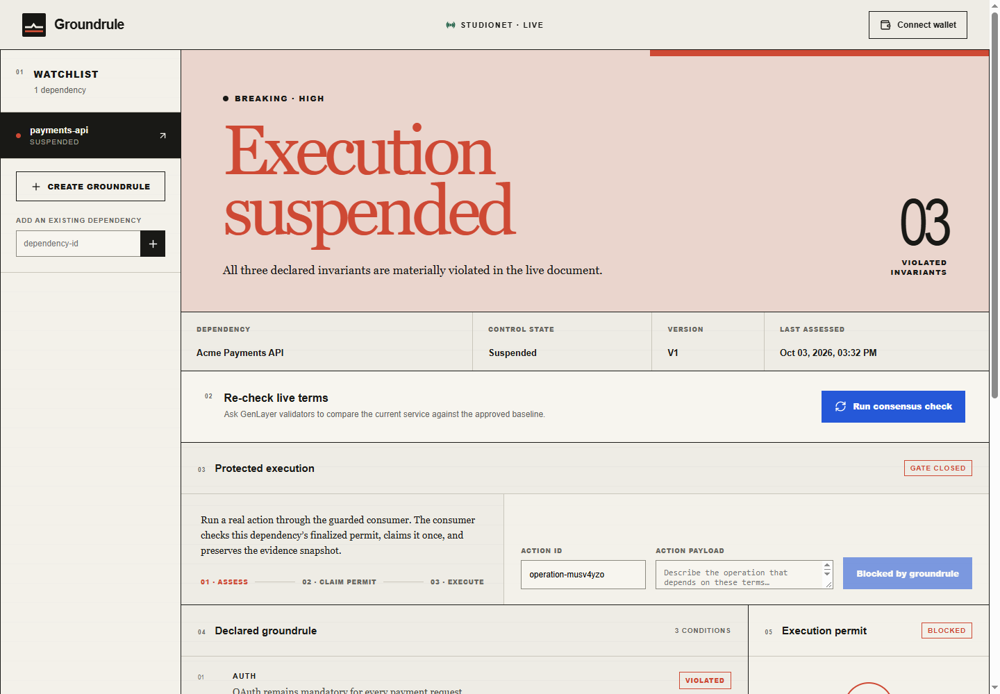

# Groundrule

Groundrule is an external-dependency control plane for autonomous agents. Teams declare the terms an agent relies on, seal an authoritative baseline, and let GenLayer validators compare those terms with the live service before an action can execute.

**Live product:** [groundrule-sand.vercel.app](https://groundrule-sand.vercel.app)



When a material condition changes, Groundrule closes the execution gate. A stale approval cannot be reused: successful assessments create short-lived, one-use permits tied to the dependency version and the exact evidence snapshot reviewed by consensus.

## What the product does

- Connects a browser wallet to GenLayer Studio Network.
- Registers new dependency controls with a sealed baseline and explicit conditions.
- Tracks multiple existing dependencies in a local watchlist.
- Runs live, consensus-backed reassessments from the interface.
- Shows the complete verdict, invariant states, source health, fingerprints, and rationale.
- Routes real operations through a guarded consumer that must claim a valid one-use permit.
- Exposes signing, submitted, finalizing, finalized, blocked, and failure states to the operator.

The included live example is intentionally in a breaking state. `payments-api` demonstrates that Groundrule blocks execution when authentication, charge-limit, and data-retention terms move outside their approved bounds.

A complete compatible-path run is also deployed as `groundrule-safe-demo-20261003`. Its registration, consensus assessment, permit consumption, and protected execution are documented in [`docs/live-verification.md`](docs/live-verification.md).

## Live GenLayer contracts

- DriftPermit controller: [`contracts/drift_permit.py`](contracts/drift_permit.py) · [`0x4Bdb443424bEe8dd22809dd0B76755109aC89615`](https://explorer-studio.genlayer.com/address/0x4Bdb443424bEe8dd22809dd0B76755109aC89615)
- Groundrule GuardedConsumer: [`contracts/guarded_consumer.py`](contracts/guarded_consumer.py) · [`0x4cEdAc7a470d81EFC151564d5887Ba616bF56C31`](https://explorer-studio.genlayer.com/address/0x4cEdAc7a470d81EFC151564d5887Ba616bF56C31)

Both complete Intelligent Contract sources are included in this repository. DriftPermit supplies the reusable consensus and permit primitive. GuardedConsumer is Groundrule's project-specific execution contract. The product layer supplies onboarding, monitoring, evidence inspection, wallet transactions, and the complete protected-execution lifecycle.

[`contracts/deployments.studionet.json`](contracts/deployments.studionet.json) maps each deployed address to its source hash and public methods. [`contracts/README.md`](contracts/README.md) explains the onchain boundary and verification commands.

## Run locally

Requirements: Node.js 20 or newer and a browser wallet such as Rabby or MetaMask. Python 3.11 or newer is required only for the contract test and lint suites.

```bash
npm install
npm run dev
```

Open `http://127.0.0.1:5173`. Reads use the same-origin StudioNet proxy. Wallet writes switch or add GenLayer Studio Network when needed. The public deployment is available at [groundrule-sand.vercel.app](https://groundrule-sand.vercel.app).

To verify the production bundle and domain behavior:

```bash
npm install
python -m pip install -r requirements.txt
npm run check
```

`npm run check` runs the frontend behavior tests, repository/deployment source-integrity test, GenLayer direct and integration tests, GenVM lint checks, and the production build. Run `npm audit --omit=dev` separately for the production dependency audit.

## Verification path

1. Open `payments-api` from the watchlist.
2. Confirm the finalized state reads `Execution suspended` with three violated conditions.
3. Inspect the authenticated baseline and live dependency fingerprints under Evidence sources.
4. Confirm Protected execution reports `Gate closed` and cannot submit an action.
5. Connect the configured operator wallet.
6. Select **Run consensus check**, approve the wallet request, and wait for the finalized transaction link.
7. Confirm the page reloads the finalized verdict and permit state rather than treating the wallet signature as success.

For a compatible dependency, the same flow opens a short-lived permit. Protected execution then claims that permit through the guarded consumer and requires a second finalized transaction before the action is shown as executed.

## Architecture

```text
authoritative baseline ─┐
                       ├─ GenLayer consensus ─ DriftPermit ─ one-use permit
live dependency ───────┘                                  │
                                                          ▼
browser wallet ─ Groundrule UI ───────────────── GuardedConsumer
```

The frontend never derives an allow decision locally. It reads control and permit state from the deployed contracts, waits for `FINALIZED` transaction receipts, and reloads contract state after every write.

## Repository layout

```text
contracts/                 complete deployed Intelligent Contract sources and address manifest
contract_tests/direct/     DriftPermit and Groundrule GuardedConsumer behavior tests
contract_tests/integration contract-to-contract simulator lifecycle
src/                       wallet-connected Groundrule product
api/                       same-origin StudioNet RPC proxy
docs/                      public live-verification evidence
```

## Configuration

Copy `.env.example` only when overriding the default StudioNet deployments:

```text
VITE_DRIFTPERMIT_CONTRACT_ADDRESS=0x…
VITE_GUARDED_CONSUMER_ADDRESS=0x…
VITE_STUDIONET_RPC_URL=/api/studionet
```

No private keys or hosted secrets are required. Browser-wallet signing remains under the operator's control.

## License

MIT
